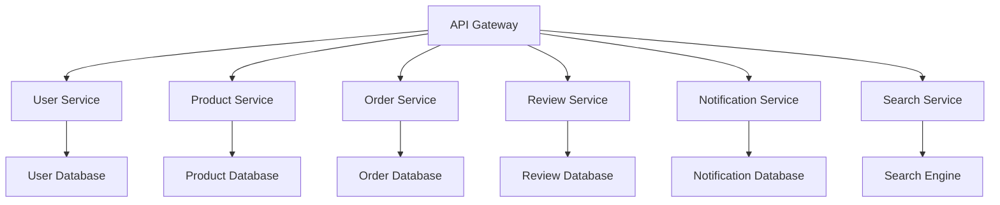
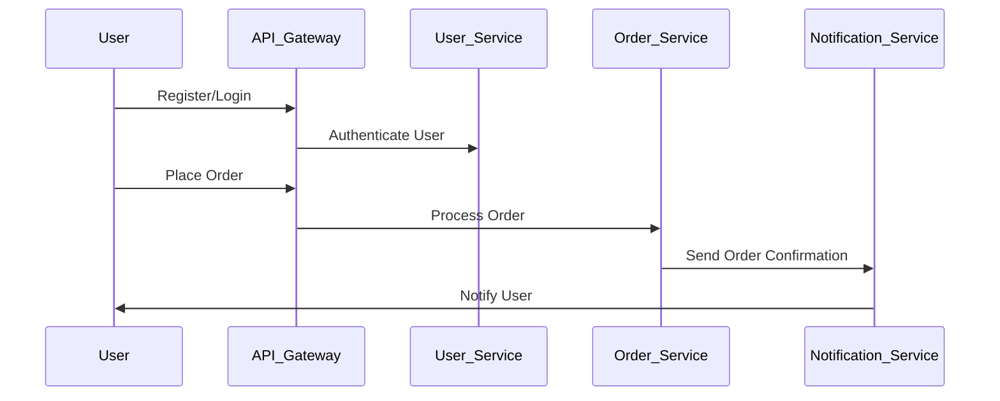

# E-Commerce Fashion Marketplace Platform Architecture Documentation

## Table of Contents
1. [Introduction](#introduction)
2. [Architecture Overview](#architecture-overview)
3. [Component Boundaries](#component-boundaries)
4. [Key Architectural Decisions](#key-architectural-decisions)
5. [Trade-offs and Rationale](#trade-offs-and-rationale)
6. [Scaling Strategy](#scaling-strategy)
7. [Diagrams](#diagrams)
8. [Related Documentation](#related-documentation)

## Introduction
This document outlines the architectural decisions made for the E-Commerce Fashion Marketplace Platform. It provides a comprehensive overview of the system's architecture, including component boundaries, trade-offs, and strategies for scaling. The goal is to ensure that developers can understand, maintain, and extend the system effectively.

## Architecture Overview
The architecture of the E-Commerce Fashion Marketplace Platform is designed as a microservices-based system. This approach allows for independent development, deployment, and scaling of various components. The platform consists of several key services, including:

- **User Service**: Manages user accounts, authentication, and authorization.
- **Product Service**: Handles product listings, inventory management, and product details.
- **Order Service**: Manages shopping carts, order processing, and payment integration.
- **Review Service**: Facilitates product reviews and ratings.
- **Notification Service**: Sends notifications to users regarding order status, promotions, etc.
- **Search Service**: Provides search functionality across products.

## Component Boundaries
Each service is encapsulated within its own boundary, ensuring that they can be developed and deployed independently. The boundaries are defined as follows:

- **User Service**: Exposes RESTful APIs for user registration, login, and profile management.
- **Product Service**: Provides APIs for CRUD operations on products and inventory management.
- **Order Service**: Offers APIs for managing shopping carts, placing orders, and processing payments.
- **Review Service**: Contains APIs for submitting and retrieving product reviews.
- **Notification Service**: Interfaces with third-party services for email and SMS notifications.
- **Search Service**: Utilizes Elasticsearch for efficient product searching.

## Key Architectural Decisions
1. **Microservices Architecture**: The decision to adopt a microservices architecture allows for scalability and flexibility. Each service can be developed in isolation and can be scaled independently based on demand.

2. **API Gateway**: An API Gateway is implemented to handle incoming requests, route them to the appropriate services, and aggregate responses. This simplifies client interactions and enhances security.

3. **Database per Service**: Each microservice has its own database to ensure data encapsulation and independence. This decision minimizes the risk of data corruption and allows for tailored database technologies per service.

4. **Event-Driven Communication**: Services communicate asynchronously using a message broker (e.g., RabbitMQ or Kafka). This decouples services and improves system resilience.

5. **Containerization**: All services are containerized using Docker, facilitating consistent deployment across different environments and simplifying orchestration with Kubernetes.

## Trade-offs and Rationale
- **Microservices vs. Monolith**: While a monolithic architecture could simplify initial development, it would hinder scalability and increase deployment complexity as the platform grows. Microservices allow for independent scaling and technology choices.

- **Synchronous vs. Asynchronous Communication**: Asynchronous communication introduces complexity in debugging and tracing requests. However, it significantly improves system resilience and performance under load.

- **Database Management**: Using multiple databases increases operational overhead. However, it allows for optimized data storage and retrieval tailored to each service's needs.

## Scaling Strategy
To ensure the platform can handle increasing loads, the following strategies are employed:

1. **Horizontal Scaling**: Each microservice can be scaled horizontally by adding more instances behind a load balancer. This is particularly effective for stateless services like the User and Product Services.

2. **Caching**: Implement caching strategies using Redis or Memcached to reduce database load and improve response times for frequently accessed data.

3. **Database Sharding**: For services with large datasets (e.g., Product Service), database sharding can be employed to distribute data across multiple database instances.

4. **Auto-scaling**: Kubernetes is configured for auto-scaling based on CPU and memory usage, allowing the platform to dynamically adjust resources based on traffic patterns.

## Diagrams
### System Architecture Diagram

### Communication Flow

## Related Documentation
- [Microservices Best Practices](https://microservices.io/)
- [Kubernetes Documentation](https://kubernetes.io/docs/home/)
- [Docker Documentation](https://docs.docker.com/)
- [Event-Driven Architecture](https://martinfowler.com/eaa.html)

This documentation serves as a comprehensive guide for developers working on the E-Commerce Fashion Marketplace Platform, ensuring they have the necessary information to understand and extend the system effectively.